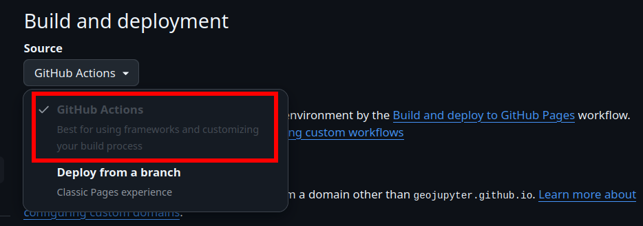

:::{note} Objectives
:class: dropdown

* Intro MyST
* Publish a website with interactive data visualizations
:::

:::{hint} Exercises
:class: dropdown

* Create a story based on previous modules
* Set up MyST and GitHub Pages to publish the story
* Use Binder? Notebooks Now?
:::


## Presentation

<iframe
  src="https://docs.google.com/presentation/d/e/2PACX-1vQxrud6Gh389Ax5vPXWUWF6YZXI_YUS_0Z3s3ovLDTDBwpEMI2NxYH3FJn9JIJMUPeCkTxm0uNOXzu8/pubembed?start=false&loop=false&delayms=60000"
  frameborder="0" width="960" height="569" allowfullscreen="true"
  mozallowfullscreen="true" webkitallowfullscreen="true">
</iframe>


## 💪 Exercise

### Step 1: Set up GitHub Pages

1. Open your repository on GitHub.
1. Click "⚙️ Settings" towards the top of the page.
    

All of the other scaffolding you need is already included in this repo in the
`.github/workflows` directory.
When you build your own MyST website, you can reproduce this with `myst init --site` and
`myst init --gh-pages`.


### Step 2: Make a change & push to GitHub

1. Edit any file in `examples/module-3/my-website`.
1. Commit and push:

    ```bash
    git add .
    git commit --message="Edit to trigger GitHub Pages deployment"
    git push origin main
    ```

### Step 3: View your new GitHub Pages deployment!

1. In your repository, view the GitHub Actions progress.
  1. From the repository home page, click the "Actions" tab towards the top.
  1. You should see an action titled "Edit to trigger GitHub Pages deployment", matching
     the commit message from the previous step.
     Is it complete (green check)?
     Or is it still in progress?
     Did it fail (red X)? Let us know if it failed.
1. View your website. Check that the change you made in the previous step is visible!
  * Your website will be available at this URL (replace `MY-USERNAME` with your username
😉):

    ```
    https://MY-USERNAME.github.io/workshop-csdms2025-examples
    ```

### Step 4: Edit your notebook to display some data (WIP)

_TODO_
