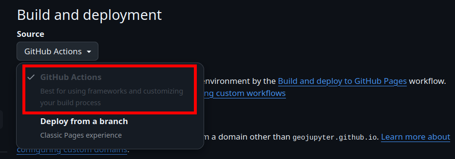

### Step 1: Set up GitHub Pages

1. **Open your repository on GitHub**.
1. **Click "⚙️ Settings"** towards the top of the page.
1. **Select "Pages"** on the left.
1. **Switch GitHub Pages to use GitHub Actions as the build & deployment source**:
    

All of the other scaffolding you need is already included in this repo in the
`.github/workflows` directory.
When you build your own MyST website, you can reproduce this with `myst init --site` and
`myst init --gh-pages`.


### Step 2: Make a change & save to GitHub

1. **Edit `index.md`** in `examples/module-3/my-website`.
   Add any content you like!
1. **Commit and push**:

    ```bash
    git commit --all --message="Edit to trigger GitHub Pages deployment"
    git push origin main
    ```

### Step 3: View your new GitHub Pages deployment!

1. In your repository, **view the GitHub Actions progress**.
  1. From the repository home page, click the "Actions" tab towards the top.
  1. You should see an action titled "Edit to trigger GitHub Pages deployment", matching
     the commit message from the previous step.
     Is it complete (green check)?
     Or is it still in progress?
     Did it fail (red X)? Let us know if it failed.
1. **View your website**. Check that the change you made in the previous step is visible!
    * Your website will be available at this URL (replace `MY-USERNAME` with your username
😉):

    ```
    https://MY-USERNAME.github.io/workshop-csdms2025-examples
    ```

1. **View the page titled "I am an example notebook"**.
   This notebook is rendered as a website, including interactive elements!


### Step 4: Edit your notebook to display some data

1. **Edit the file `examples/module-3/my-website/example.ipynb` in JupyterHub**.
1. Modify the 2nd code cell to add GeoJSON data to the website.
   **Add the following code to the 2nd to last line, before `m`**:

   ```python
   folium.GeoJson("seec_and_nsidc.geojson").add_to(m)
   ```

1. **Save your notebook**.


### Step 5: Save to GitHub

```bash
git commit --all --message="Complete module 3"
git push origin main
```


### Step 6: View your website!

It may take a minute or two; don't forget, you can view the progress in the "Actions"
tab of your repository.

Check the example notebook rendered correctly on the website.
